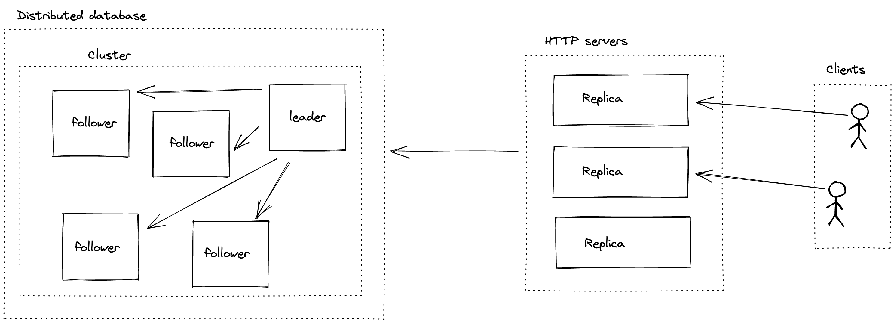

# Development Diary

## 4 September '21

[raft-rs]: https://github.com/tikv/raft-rs
[etcd's raft]: https://github.com/etcd-io/etcd/tree/main/raft

The current mental model of how to put together my Raft implementation does not make sense. I was
thinking that I'd have a Raft library which provides Raft functionality and embed that directly into
a HTTP server i.e each server would be a Raft node. You would then have end points `appendEntries`
and `RequestVote` end points. So stupid argghhhhhh.

So what do we actually need?

In the diagram above is an example architecture of a web service backed by a distributed database. This
gives key insights into how I ought to think about this. First, Raft works on the *storage* system
(obviously, c'mon Senyo!). Our Raft nodes are nodes of our storage system, not the HTTP servers themselves.
Each of the HTTP server replicas write to the same storage system and so we have one distributed database
for the web service. In steps, the process would be:

1. Client makes a (write) request to web service
2. A replica accepts the request and writes to the database
3. The write request is accepted by the leader of the storage system cluster
4. The write is replicated to the followers in the cluster
5. Done!

Now I have a good mental model to work with! We will still need the Raft library but instead, it will
be used by the storage component.
