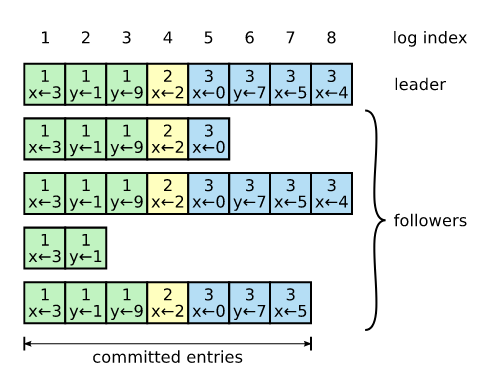
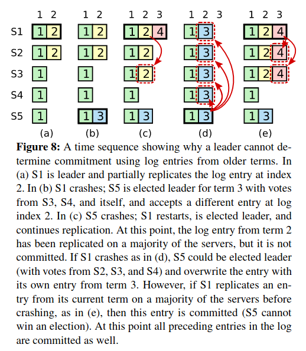

# Raft

> 🌱 Raft is a consensus algorithm for managing a replicated log

The primary objective for the algorithm designers was *understandability*. This was the basis for all
design decisions. Other objectives include:

- Provide a complete and practical foundation for system building
- Safe under all conditions
- Available under typical operating conditions
- Efficient for common operations

> 🌱 Raft separates key elements of consensus: leader election, log replication, safety and membership
> changes

> 🌱 Raft intentionally reduces the state space by reducing the number of possible states

## The basics

Raft has a set of guarantees:

- Election safety: at most one leader can be elected in a term
- Leader append-only: a leader never overwrites or deletes entries in its log; only appends new entries
- Log matching: if two logs contain an entry with the same index and term, they are identical in all
  entries up to the given index
- Leader completeness: if a log entry is committed in a given term, that entry will be present in the
  logs of the leaders for all higher-numbered terms
- State machine safety: if a server has applied a log entry at a given index to its state machine, no
  other server will apply a different log entry for the same index

> 🌱 Raft elects a leader and gives the leader complete responsibility for managing the replicated log.

The leader:

1. Accepts log entries from clients
2. Replicates them on servers
3. Tells servers when it is safe to apply log entries

Each server can be in one of three states:

- Leader
- Follower
- Candidate

In normal operation, there is *exactly* one leader and the rest are followers. Followers are passive;
they can only respond to requests. Leaders handle all client requests. Candidates are vying to be leader
during an election period.

### Terms

Raft divides time into *terms*.

> 🌱 A term acts as  a logical clock

It is an arbitrary length of time that a specific server is the leader. A new term is only started
when a new leader is elected. They are numbered with consecutive integers.

Each server stores the current term number. The current term is exchanged whenever servers communicate.
This has the some nice consequences:

- If a server's current term is smaller than others, it updates its current term to the larger value
- If a candidate or leader discovers its term is stale it immediately reverts to follower state
- If a server receives a request with a stale term, it rejects the request

### Communication

Servers communicate using remote procedure calls (RPCs). The basic consensus algorithm requires two
types of RPCs:

- RequestVote RPCs - initiated by candidates during elections
- AppendEntries RPCs - initiated by leaders to replicate log entries and to provide a form of heartbeat

## Leader Election

Raft uses a heartbeat mechanism to trigger leader election. When a server starts up, it begins as follower.
It remains a follower as long as it receives valid RPCs from a leader or candidate. If a follower receives
no communication over a period of time called the *election timeout*, it assumes there is no viable leader.
It begins an election to elect a new leader.

> 🌱 Leaders send periodic heartbeats to all followers in order to maintain authority

> 🍁 A heartbeat is an AppendEntries RPC that carries no log entries.

The election process:

1. To begin an election, a follower increments its current term and transitions to candidate state
2. It votes for itself and issues RequestVote RPCs in parallel to each of the other servers in the cluster
3. A candidate continues in this state until one of three events occur:
    - It wins the election
    - Another server establishes itself as leader
    - A period of time goes by with no winner

### I win the election

A candidate wins the election if it receives votes from a mjority of the servers in the *full* cluster
for the same term. Each server votes for at most one candidate in a given term, on a first-come-first-served
basis. The majority rule ensures that at most one candidate can win the election for a given term.
Once a candidate becomes leader, it sends heartbeat messages to all of the other servers to establish
its authority and prevent new elections.

### Another wins the election

While waiting for votes, a candidate may receive an AppendEntries RPC from another server claiming to
be leader. If that server's term is at least as large as the candidate's term, it recognizes the leader
as legitimate and returns to follower state. If that server's term is smaller, the candidate rejects
it and continues in candidate state.

### No one wins

If many followers become candidates at the same time, votes could be split so that no candidate obtains
a majority. When this happens, each candidate times out and starts a new election by incrementing its
vote and then repeating the process. Naturally, without careful design, this could lead to indefinite
rounds of elections.

> 🌱 Raft uses randomized election timeouts to ensure split votes are rare and resolved quickly

Randomized timeouts spread out the servers so that in most cases only a single server will time out.
It will win the election and send heartbeats before any other servers time out.

## Log Replication

The leader receives all client requests. A client request contains a command to be executed by the
replicated state machines. The process:

1. The leader appends the command to its log as a new entry
2. It issues AppendEntries RPCs in parallel to each of the other servers to replicate the entry
3. Once  the entry has been safely replicated, the leader applies the entry to its state machine and
   returns the result to the client.
4. If followers crash or run slowly or any other problem such as network issues, the leader retries
   AppendEntries RPCs indefinitely until all followers eventually store all log entries.

> 🌱 Replicated means that the server has successfully appended the entry to its log

The way logs are organised is shown below.

Each log entry stores:

1. State machine command
2. The term number when the entry was received by the leader
3. Integer index identifying its position in the log

The term numbers are used to detect inconsistencies between logs and to ensure some of the guarantees
stated earlier are upheld.

The leader decides when it is safe to apply a log entry to the state machines.

> 🌱 An entry that is safe to apply is called a *committed entry*

Raft guarantees that a committed entry is durable and will *eventually* be executed by all of the *available*
state machines.

> 🌱 A log entry is committed once the leader has replicated it on a majority of servers

This also commits all preceding entries in the leader's log, including all preceding entries by previous
leaders. The leader keeps track of the highest index it knows to be committed and includes it in future
AppendEntries RPCs (including heartbeats) so that other servers eventually find out. Once a follower
learns a log entry is committed, it applies the entry to its local state machine.

Raft guarantees the following properties which constitute the Log Matching Property:

1. If two entries in different logs have the same index and term, then they store the same command
2. If two entries in different logs have the same index and term, then the logs are identical in all
   preceding entries

The first property is upheld as a leader creates at most one entry with a given log index in a given
term and log entries never change position in the log. The second is upheld by a consistency check
performed by AppendEntries. When sending an AppendEntries RPC, the leader includes the index and term
of the entry immediately preceding new entries. If the follower does not find an entry in its log with
the same index and term, it refuses new entries. Thus, if AppendEntries returns successfully, the leader
knows that the follower's log is identical to its log up to the new entries.

### Maintaining consistency

The leader handles inconsistencies in the logs by forcing the follower's logs to duplicate its own.
Conflicting entries in the follower logs will be overwritten with entries from the leader's log.

To do this, the leader:

1. Finds the latest log entry in the follower where they both agree
2. Deletes any entries in the follower after that point
3. Sends the follower all of its entries after that point

All of these actions happen in response to the consistency checked performed by the AppendEntries RPC.
The leader maintains a `nextIndex` for each follower. This is the index of the next log entry the leader
will send to that follower. This allows it to perform the above steps. The process works as follows:

1. When a leader comes into power, it initializes all `nextIndex` values to the index just after the
   last one in its log.
2. If a follower's log is inconsistent with the leader's, it fails the consistency check.
3. After a failure, the leader decrements the `nextIndex` value for that follower
4. It retries the AppendEntries RPC
5. Steps 2 - 4 repeat until AppendEntries succeeds. At this point, the leader and follower logs match.
6. The logs from the leader are appended to the follower's logs (if there are any)
7. The leader and follower are now consistent

> 🌱 A leader never overwrites or deletes entries in its own log

## Safety

The mechanisms presented so far are not sufficient to ensure each state machine executes exactly the
same commands in the same order.

### Election Restriction

> 🌱 In a leader-based consensus algorithm, the leader must eventually store all of the committed log
> entries

Raft guarantees that all committed entries from previous terms are present on a new leader from when
it is elected. This means:

1. Logs *only* flow from leader to follower
2. Leaders never overwrite existing entries in their logs

Raft uses the voting process to prevent a candidate from winning an election unless its log contains
all committed entries.

1. A candidate must contact a majority of the cluster to be elected
2. This means every committed entry must be present in at least one of those servers
3. If the candidate's log is at least as up-to-date as any other log in the majority, it is guaranteed
   to hold all committed entries.

Determining which log is more up-to-date is done by comparing the index and term of the last entries
in the logs.

1. If the last entries have different terms, the log with the later term is more up-to-date
2. If the last entries have the same term, the log which is longer is more up-to-date

The RequestVote RPC implements this restriction. The RPC includes information about the candidate's log.
The voter rejects the candidate if its own log is more up-to-date than the candidate.

### Committing entries from previous terms

A leader cannot conclude that an entry from a previous term is committed once it is stored on the majority
of servers. An explanation can be found in the image below

> 🌱 Raft never commits log entries from previous terms by counting replicas

In contrast, log entries from the leader's current term are committed by counting replicas. Once an entry
from the current term has been committed, all prior entries are committed indirectly because of the Log
Matching Property.

### Follower and candidate crashes

TODO

## Timing and availability

Leader election is the aspect of Raft where timing is most critical. Raft will be able to elect and maintain
a steady leader if the following requirement is satisfied:

> broadcast time << election timeout << Mean Time Between Failures (MTBF)

> 🌱  MBTF is the average time between failures for a single single server

> 🌱  The broadcast time should be an order of magnitude less than the election timeout

This is so that leaders can reliably send heartbeat messages required to keep followers from starting
elections. It also mitgates split votes from occuring frequently.

> 🌱  The election timeout should be a few orders of magnitude less than the MTBF

This allows the system to make steady progress. If a leader crashes, the system will be unavailable
for roughly the election timeout. This ideally constitutes a small fraction of overall time.

> 🌱 Election timeout is usually set between 10 and 500 milliseconds

## Cluster Membership Changes

TODO

## Log Compaction

TODO

## Client Interaction

Clients send all requests to the leader. If the client sends a request to a follower, it will reject
the request and supply information about the most recent leader it has heard from.

> 🌱 AppendEntries RPC include the network address of the leader

> 🌱 One of Raft's goals is to implement linearizable semantics

This means each operation appears to execute instantaneously, exactly once, at some point between
invocation and response.

In reality, Raft can execute a command multiple times. The solution is for clients to assign unique
serial numbers to every command. The state machine tracks the latest serial number processed for
each client, along with the associated response. If it receives a command with a serial number that
has already been executed, it responds immediately without re-execution.

Raft has two precautions to ensure serializable semantics for read-only operations.

1. A leader must have the latest information on which entries are committed
2. A leader must check whether it has been deposed before processing a read-only request

The first precaution is guaranteed by the Leader Completeness Property. It guarantees that a leader has
all committed entries. However, at the start of the term, it may not know which those are. To find out,
it commits an entry from its term. This is the *no-op* entry which is done at the start of its term.
For the second precaution, the leader performs the check by exchanging heartbeat messages with a majority
of the cluster before responding to the request.
